## ESP32-P4 Home Assistant Display

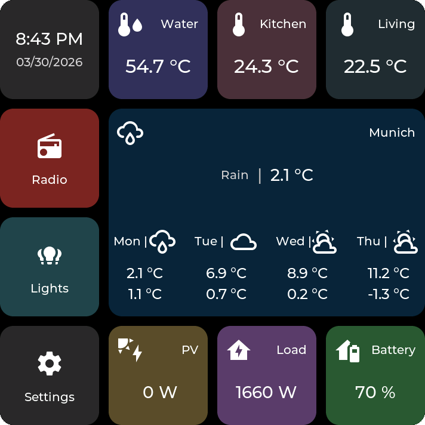

Tile-based ESP32-P4 firmware for Home Assistant dashboards with a fully configurable web interface.

The project currently supports multiple ESP32-P4 display devices and combines:

- OTA firmware updates from the built-in web interface
- touch-first dashboard UI
- MQTT-based Home Assistant integration
- on-device web configuration
- LittleFS-backed runtime storage with optional microSD support for screenshots

 

## Requirements

**Important:** This firmware requires the Home Assistant bridge/integration:
[ESP32-P4 HomeAssistant Display Bridge](https://github.com/GalusPeres/ESP32-P4-HomeAssistant-Display-Bridge)

- Home Assistant
- MQTT broker
- Home Assistant bridge/integration:
  [ESP32-P4 HomeAssistant Display Bridge](https://github.com/GalusPeres/ESP32-P4-HomeAssistant-Display-Bridge)

## New In v0.1.7

- Web admin now includes a microSD file manager for upload, download, rename, delete, and folder creation
- File manager uses breadcrumb navigation, selectable rows, and a clear microSD availability indicator
- LittleFS access is intentionally blocked in the file manager to avoid accidental changes to runtime data

Popup examples from the Waveshare B4:

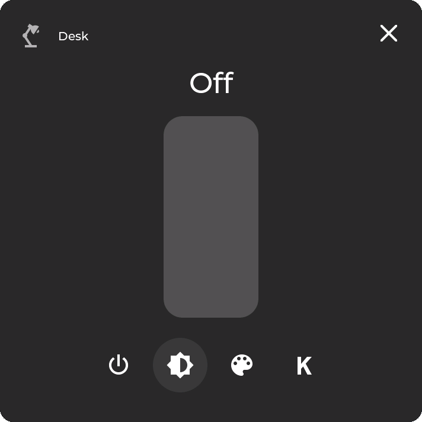 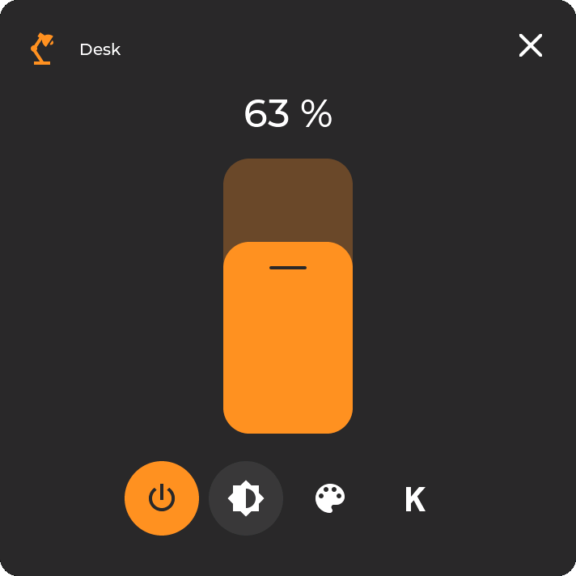 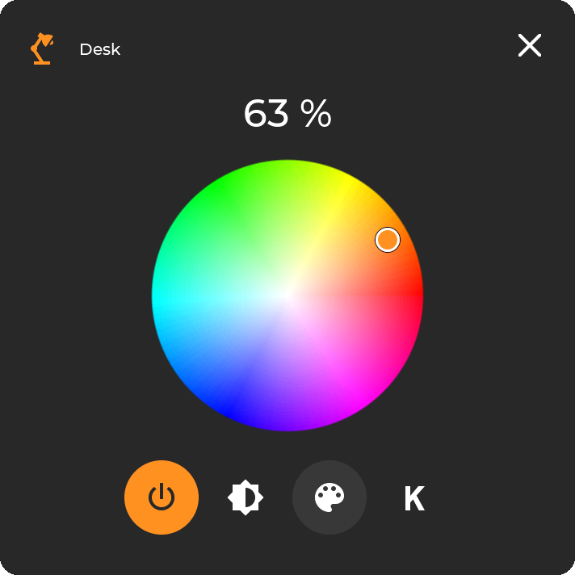 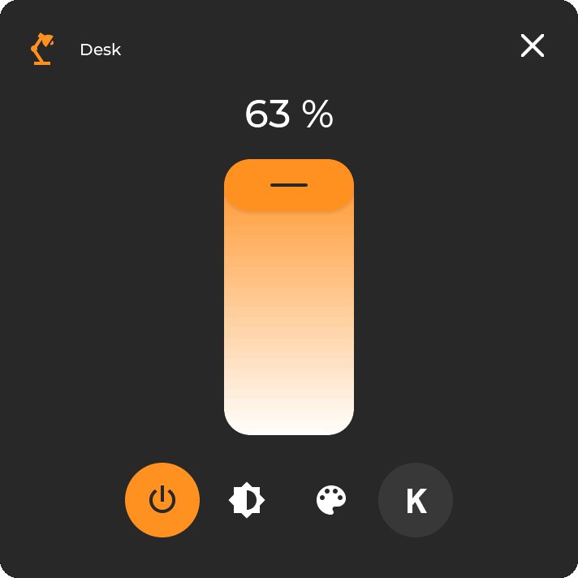

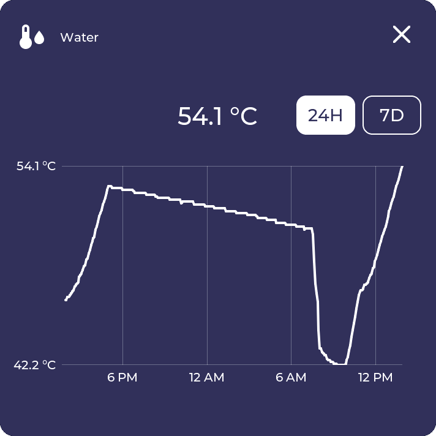 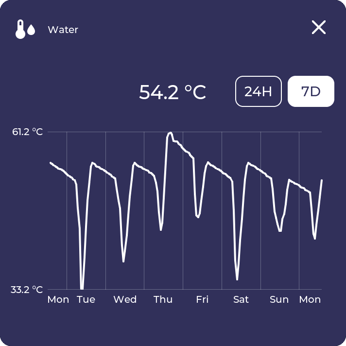 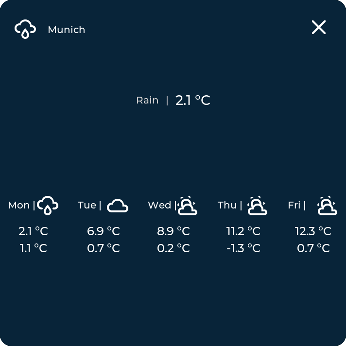

## Overview

This firmware turns supported ESP32-P4 touch displays into configurable Home Assistant control panels.

Everything visible on the dashboard is tile-based and managed from the built-in web interface:
- add, remove, move, and resize tiles
- drag and drop tiles between positions directly in the web interface
- configure tile content and behavior
- create folders and navigation structures
- manage WiFi, MQTT, language, and time zone settings without changing code

## Supported Devices

- [M5Stacks Tab5](https://shop.m5stack.com/products/m5stack-tab5-iot-development-kit-esp32-p4)
- [Waveshare B4](https://www.waveshare.com/esp32-p4-wifi6-touch-lcd-4b.htm)

Device-specific Arduino IDE settings are documented in [BOARD_SETTINGS.md](BOARD_SETTINGS.md).

## Screenshots

The screenshots below were captured on the Waveshare B4. They are meant as example views of the UI; the same firmware and web admin panel also run on the M5Stacks Tab5.

### Main Views

Home dashboard, folder view, and settings screen:

 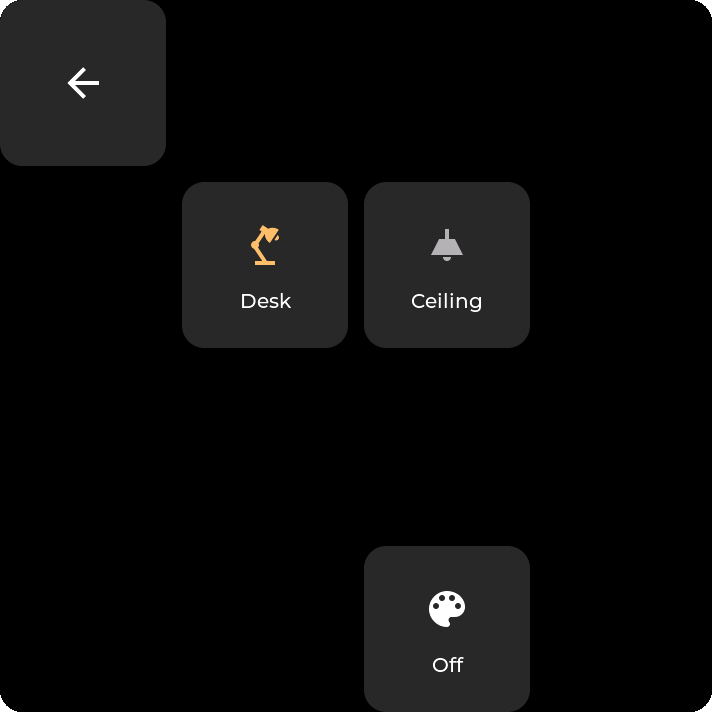 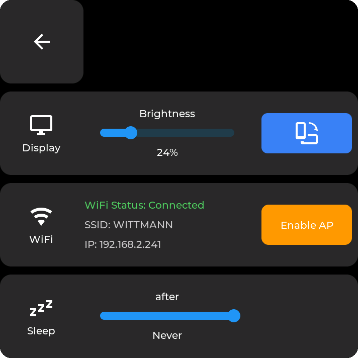

### Popups

Sensor history views:

  

Light control views:

   

### Web Admin

Built-in web admin interface for tiles, folders, WiFi, MQTT, and layout configuration:

  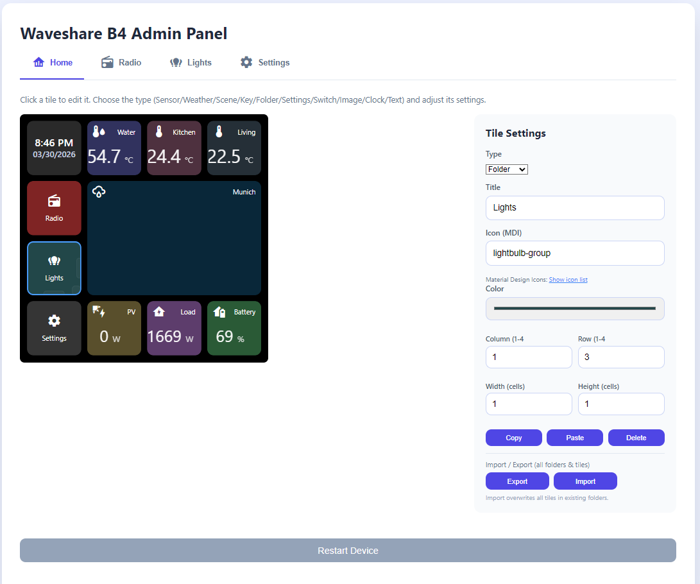

## Features

- OTA firmware updates directly from the built-in web admin panel
- Fully tile-configurable dashboard via the built-in web admin panel
- Drag-and-drop tile layout editing in the web admin panel
- MQTT-based Home Assistant communication
- Access Point based first-time setup
- Device-local WiFi and MQTT configuration
- English and German UI/admin support
- Home Assistant energy statistics tile with 24h and 7d popup charts
- Runtime storage on internal LittleFS
- Optional screenshot export to microSD from the web interface
- Tile types currently include:
  - clock
  - counter
  - energy
  - empty
  - key
  - navigate
  - scene
  - sensor
  - switch
  - text
  - weather

## Installation

### Option 1: Prebuilt Binaries

If release binaries are available, download the files matching your device:

- `...m5stacks-tab5-factory.bin`
- `...m5stacks-tab5-update.bin`
- `...waveshare-b4-factory.bin`
- `...waveshare-b4-update.bin`

Use:
- `factory.bin` for a clean first flash
- `update.bin` for updating an existing device

When using the ESP Flash Download Tool:
- flash `factory.bin` at `0x00000`
- flash `update.bin` at `0x10000`
- a manual reset after flashing may be required

### Option 2: Build From Source

1. Open [ESP32_P4_HomeAssistant_Display.ino](ESP32_P4_HomeAssistant_Display.ino) in the Arduino IDE.
2. Select the target device in [src/devices/device_select.h](src/devices/device_select.h).
3. Apply the correct board settings from [BOARD_SETTINGS.md](BOARD_SETTINGS.md).
4. Build and flash the firmware.

## First Setup

1. Flash the firmware.
2. Boot the device.
3. Activate AP mode on the device to continue setup.
4. Connect your phone or computer to the temporary device WiFi Access Point.
5. Use password `12345678`.
6. Open the captive portal and enter your WiFi credentials.
7. After saving, the device restarts and connects to your WiFi network.
8. Open the on-device `Settings` tab and note the displayed IP address.
9. Open the web admin panel through that IP address.
10. Enter your MQTT settings in the web interface.
11. Set up the Home Assistant bridge/integration so the device receives entity data:
     [ESP32-P4 HomeAssistant Display Bridge](https://github.com/GalusPeres/ESP32-P4-HomeAssistant-Display-Bridge)
12. Configure your tiles, folders, and layout.

Optional:
- Insert a FAT32-formatted microSD card if you want to use screenshot export from the web interface.
- A microSD card can also be useful for one-time migration from older SD-based setups.

## Home Assistant Integration

This firmware expects the Home Assistant side to be provided by the MQTT bridge/integration:

- [ESP32-P4 HomeAssistant Display Bridge](https://github.com/GalusPeres/ESP32-P4-HomeAssistant-Display-Bridge)

That integration handles the Home Assistant-side MQTT communication and entity bridge.
For Energy tiles, Home Assistant energy statistics, live icon updates, and popup history, use the current bridge release.

## Repository Structure

- `src/` firmware source code
- `docs/images/` screenshots and documentation images
- `electron-app/` desktop companion tooling
- `mdi-extractor/` icon tooling
- `simconnect-bridge/` additional companion tooling
- `BOARD_SETTINGS.md` documented Arduino IDE board settings

## Known Issues

- Waveshare B4: software restart is currently unreliable. The display may remain black after a restart even though the firmware continues to run. Workaround: press the hardware reset button once.
- Waveshare B4: tile edits can briefly flash blue after the move from SD-backed storage to LittleFS. This appears to be caused by writes to internal flash during live updates. Runtime Home Assistant icon changes no longer write icon metadata to flash.
- M5Stacks Tab5: Access Point mode is currently only reliable with a battery installed. Without a battery, keep brightness at the lowest available level; otherwise the device can crash.

## Notes

- A microSD card is no longer required for normal runtime operation.
- A microSD card is currently only needed for screenshot export and optional migration from older SD-based setups.
- Board selection and board settings must match the target device.
- In general, the M5Stacks Tab5 currently feels noticeably slower than the Waveshare B4. This may be related to the display driver or another device-specific bottleneck. If you know the cause or a fix, help is welcome.
- A Windows Electron companion app also exists under `electron-app/`. It can be used to send PC-side data to the device, for example Microsoft Flight Simulator values, system metrics, or simulated keyboard input/commands for Windows. This still needs proper documentation and its own release packaging.

## License

This project is licensed under the MIT License. See [LICENSE](LICENSE).
