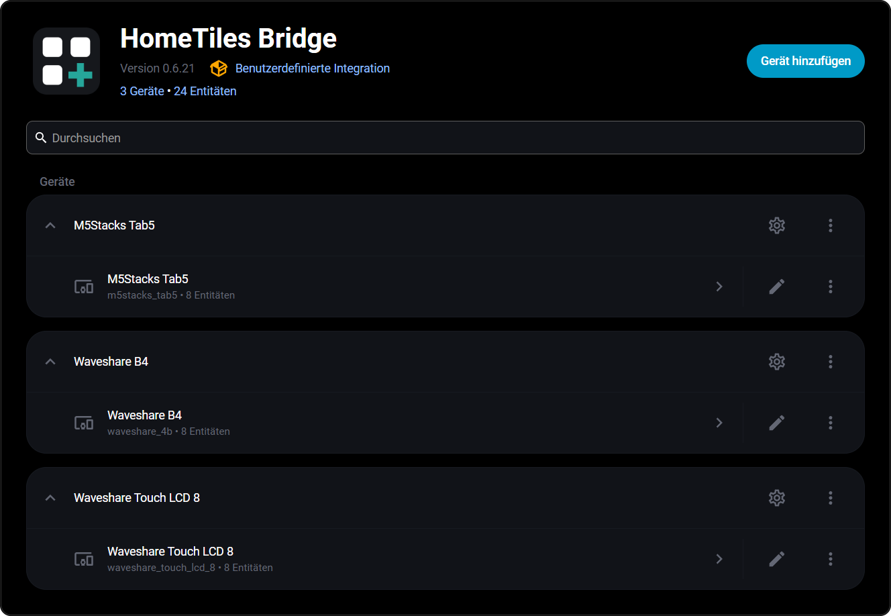

# Bridge Integration

The [HomeTiles Bridge](https://github.com/GalusPeres/HomeTiles-Bridge) connects your displays to Home Assistant over MQTT. It shares entity data and sends tile actions back to Home Assistant, with each display listed as its own device.

<figure class="ht-screenshot">

<figcaption>Displays in the HomeTiles Bridge integration</figcaption>
</figure>

## Installation

You need Home Assistant 2025.11 or newer, an MQTT broker, and HomeTiles Bridge v0.6.40 or newer for all documented tile features. Follow the [Home Assistant setup guide](home-assistant-setup.md) to install the Bridge and pair your first display.

HACS provides Bridge updates. After an update, restart Home Assistant. For additional displays, follow [Multiple displays](home-assistant-setup.md#multiple-displays).

## Configuration

Open **Settings → Devices & Services → HomeTiles Bridge → Configure**.

### Panel Settings

| Field | Setting |
| --- | --- |
| Base topic | Must match **Device topic base** in the display's MQTT settings. Each display needs a unique value. |
| HA prefix | Default: `ha/statestream`. Use the same value on the Bridge and all displays. |
| Device name / manufacturer / model | Optional details shown in Home Assistant. |

### Entity Configuration { data-toc-label="Entities" }

Select the sensors, binary sensors, weather, lights, switches, covers, climate entities, media players, cameras, and scenes/scripts you want to use. Then assign them to tiles in the [Web Admin](web-admin.md).

Selections are shared across all displays. Scene and script aliases are generated automatically; custom aliases use one `alias=entity_id` per line.

### Energy Dashboard

Enable the electricity, gas, or water categories you need. Each requires the corresponding data in Home Assistant's [Energy Dashboard](https://my.home-assistant.io/redirect/energy/). These selections are also shared across displays.

## Local Hardware Entities { data-toc-label="Local I/O" }

Configure GPIO switches, onboard relays, and DS18B20 inputs on the display's [I/O tab](hardware-io.md). The Bridge adds them to that display's Home Assistant device automatically; they do not belong in the shared entity selection.

Saving an assignment announces it again. Deleting it makes the old Home Assistant entity unavailable. Names you changed manually in Home Assistant are preserved.

## Experimental Camera Transport { data-toc-label="Camera connection" }

Camera tiles are available on ESP32-P4. Allow the display to reach the Home Assistant host on TCP ports `8124`–`8131`. The Bridge sends display-sized JPEG frames directly over the local network; MQTT handles camera control.

Each open display uses its own stream. Video conversion uses Home Assistant CPU time, while snapshot cameras are limited by their source refresh rate. See [Camera troubleshooting](faq.md#the-camera-tile-asks-for-a-newer-bridge-or-never-shows-video) if no video appears.

## MQTT Topics Reference { data-toc-label="MQTT reference" }

Entity states use `<HA prefix>/<entity>/...`. The Bridge publishes them itself; Home Assistant's MQTT Statestream integration is not required.

??? info "Topic reference for debugging"
    `{id}` is the panel device ID; `<base>` is its unique base topic.

    | Topic | Direction | Purpose |
    | --- | --- | --- |
    | `<base>/stat/connected` | Display → HA | Connection status |
    | `tab5_lvgl/config/{id}/bridge` | Display → HA | Device and local I/O announcement |
    | `tab5_lvgl/config/{id}/bridge/apply` | HA → Display | Configuration |
    | `tab5_lvgl/config/{id}/bridge/icons` | HA → Display | Icon updates |
    | `tab5_lvgl/config/{id}/history/*` | Both | Sensor history |
    | `tab5_lvgl/config/{id}/weather/*` | Both | Weather forecasts |
    | `tab5_lvgl/config/{id}/energy/*` | Both | Energy data |
    | `<base>/cmnd/light` | Display → HA | Light controls |
    | `<base>/cmnd/switch` | Display → HA | Switch controls |
    | `<base>/cmnd/media` | Display → HA | Media controls |
    | `<base>/cmnd/climate` | Display → HA | Climate controls |
    | `<base>/cmnd/cover` | Display → HA | Cover controls |
    | `<base>/cmnd/scene` | Display → HA | Scene/script activation |
    | `<base>/cmnd/camera` | Display → HA | Open/close a camera session |
    | `<base>/stat/camera` | HA → Display | Camera connection and status |
    | `<base>/cmnd/display_brightness` | HA → Display | Display brightness (1–100%) |
    | `<base>/stat/display_brightness` | Display → HA | Current display brightness |
    | `<base>/cmnd/screensaver_brightness` | HA → Display | Screensaver brightness (1–100%) |
    | `<base>/stat/screensaver_brightness` | Display → HA | Current screensaver brightness |
    | `<base>/cmnd/io/{channel_id}` | HA → Display | Local Switch command (`ON` / `OFF`) |
    | `<base>/stat/io/{channel_id}` | Display → HA | Local Switch or temperature state |
